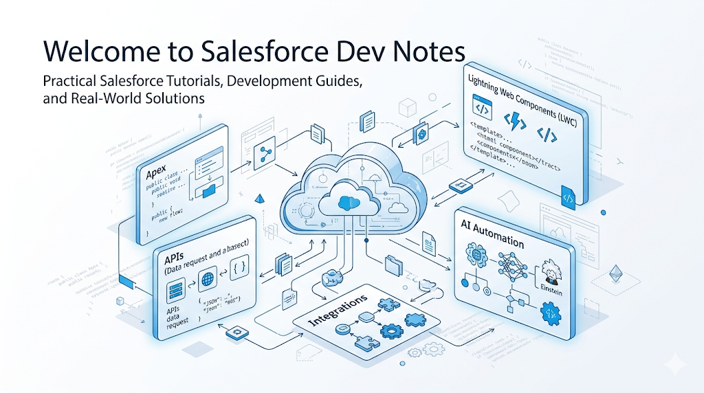

# Welcome to Salesforce Dev Notes

## Introduction

Welcome to Salesforce Dev Notes, a blog dedicated to helping Salesforce developers learn, build, and grow through practical tutorials, real-world examples, and development best practices.

Whether you're a beginner starting your Salesforce journey or an experienced developer looking to deepen your knowledge, this blog is designed to provide valuable insights that you can apply directly in your projects.

## Why I Created Salesforce Dev Notes

Throughout my career as a Salesforce Developer, I've spent countless hours learning new concepts, solving complex problems, debugging issues, and exploring different parts of the Salesforce ecosystem.

One thing I noticed is that many tutorials focus on simple examples but rarely explain how things work in real-world projects. As a result, developers often struggle when they encounter actual business requirements.

I created Salesforce Dev Notes to bridge that gap by sharing practical knowledge, lessons learned from real projects, and solutions to common development challenges.

## What You'll Find Here

This blog covers a wide range of Salesforce development topics, including:

### Apex Development

Learn how to build scalable and maintainable Apex solutions, including:

- Triggers
- Classes
- Batch Apex
- Queueable Apex
- Future Methods
- SOQL and SOSL
- Governor Limits
- Testing Best Practices

### Lightning Web Components (LWC)

Explore modern Salesforce frontend development through:

- Component Fundamentals
- Data Binding
- Wire Service
- Apex Integration
- Navigation
- Events and Communication
- UI Design Best Practices

### Salesforce Integrations

Discover how Salesforce connects with external systems using:

- REST APIs
- Webhooks
- Named Credentials
- Platform Events
- Authentication Methods
- Third-Party Integrations

### Agentforce and AI

Learn how Salesforce AI technologies can be used to build intelligent solutions, including:

- Agentforce Fundamentals
- AI-Powered Workflows
- Prompt Templates
- Automation Strategies
- Real-World AI Use Cases

### System Design and Architecture

Understand how enterprise Salesforce applications are designed and maintained through topics such as:

- Design Patterns
- Trigger Frameworks
- Integration Architecture
- Performance Optimization
- Security Best Practices

## Who This Blog Is For

Salesforce Dev Notes is designed for:

- Salesforce Developers
- Salesforce Administrators
- Technical Architects
- Students Learning Salesforce
- Professionals Preparing for Certifications
- Anyone Interested in Salesforce Technology

Whether you're preparing for your first Salesforce certification or designing enterprise-level solutions, you'll find content that helps you improve your skills.

## What Makes This Blog Different

The goal of Salesforce Dev Notes is not just to explain concepts but to demonstrate how they are applied in real-world development scenarios.

Each article aims to provide:

- Clear explanations
- Practical examples
- Best practices
- Common mistakes to avoid
- Real project insights

My focus is on helping developers understand the "why" behind a solution, not just the implementation steps.

## What's Coming Next

In upcoming articles, we'll explore:

- What Salesforce Is and How It Works
- Understanding Apex Triggers
- Salesforce Order of Execution
- Lightning Web Components Fundamentals
- Working with REST APIs in Salesforce
- Agentforce Development
- Salesforce Design Patterns
- Interview Preparation Guides

And much more.

## Final Thoughts

Thank you for visiting Salesforce Dev Notes.

My goal is to create a valuable resource for the Salesforce community by sharing practical knowledge, development experiences, and technical insights. I hope these articles help you become a better Salesforce professional and make your development journey more enjoyable.

Happy Coding!

— Juned Khan
Salesforce Developer
